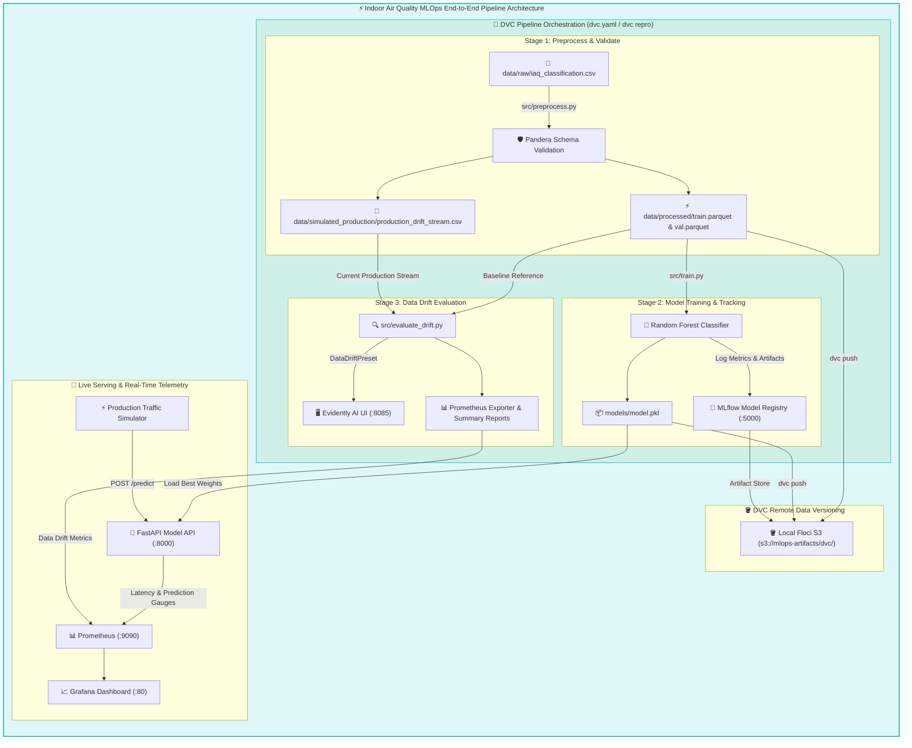
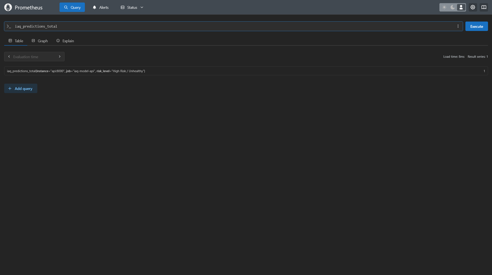

# Indoor Air Quality MLOps Pipeline & Local Infrastructure Foundation

An end-to-end Machine Learning MLOps pipeline for Indoor Air Quality (IAQ) safety monitoring, built on top of a lightweight local MLOps infrastructure foundation. This project demonstrates data validation (Pandera), data version control (DVC), model experiment tracking (MLflow), API serving (FastAPI), live telemetry (Prometheus & Grafana), and data drift detection (Evidently AI), all running locally using Docker Compose without cloud costs.


<a id="purpose"></a>
## 🎯 Project Purpose & Scope

This repository provides a pre-configured local MLOps infrastructure foundation alongside a fully automated Indoor Air Quality classification machine learning pipeline orchestrated by DVC:




<a id="what-you-get"></a>
## ✨ What You Get

### 🛠️ Infrastructure & Platform Stack

| Component | Technology | Purpose |
| --- | --- | --- |
| **Local S3 Storage** | Floci (`:4566`) | S3-compatible object storage for DVC datasets, model weights, and MLflow artifacts. |
| **S3 Management Web UI** | Floci UI (`:8080`) | Visual web console for browsing S3 buckets, folders, and uploaded objects. |
| **Metrics Visualization** | Grafana (`:80`) | Pre-configured dashboards for real-time container, host hardware, and ML drift metrics. |
| **Metrics Storage** | Prometheus (`:9090`) | Stores and queries application, prediction traffic, container, and drift metrics. |
| **Telemetry Collectors** | Telegraf & Node Exporter | Cross-platform container and host hardware metrics collectors (WSL2 compatible). |
| **Reverse Proxy** | NGINX (`:80`) | Unified ingress routing for Grafana and local web endpoints. |

### 🤖 Machine Learning Pipeline Stack

| Component | Technology | Purpose |
| --- | --- | --- |
| **Data Version Control** | DVC (`dvc[s3]`) | Reproducibility engine (`dvc.yaml`) & versioning tool backed by local Floci S3 storage. |
| **Data Validation** | Pandera | Enforces strict schema types, non-null checks, and value boundaries on sensor features. |
| **Experiment Tracking** | MLflow (`:5000`) | Logs parameters, metrics (F1, Accuracy), ROC curves, and registers model checkpoints. |
| **Model Serving API** | FastAPI (`:8000`) | High-performance REST API serving real-time air quality risk predictions. |
| **Data Drift UI** | Evidently AI (`:8085`) | Interactive workspace dashboard for visualizing data drift and feature distribution shifts. |
| **Model Engine** | Scikit-Learn | Random Forest multi-class classification for IAQ safety risk levels. |


<a id="pipeline-workflow"></a>
## 🔄 ML Pipeline Architecture & DVC Stage Breakdown

The pipeline is defined in `dvc.yaml` and divided into 3 reproducible stages:

<details>
<summary>🔍 <b>Expand to view complete <code>dvc.yaml</code> pipeline configuration</b></summary>

```yaml
stages:
  preprocess:
    cmd: python src/preprocess.py
    deps:
      - src/preprocess.py
      - src/schema.py
      - data/raw/iaq_classification.csv
    outs:
      - data/processed
      - data/simulated_production/production_drift_stream.csv

  train:
    cmd: python src/train.py
    deps:
      - src/train.py
      - data/processed/train.parquet
      - data/processed/val.parquet
    outs:
      - models/model.pkl

  evaluate_drift:
    cmd: python src/evaluate_drift.py
    deps:
      - src/evaluate_drift.py
      - data/processed/train.parquet
      - data/simulated_production/production_drift_stream.csv
    outs:
      - docs/reports/data_drift_report.html
      - docs/reports/data_drift_summary.json
```

</details>

### 1. Data Engineering & Pandera Validation (`src/preprocess.py` & `src/schema.py`)
- **Schema Enforcement**: Pandera schemas validate raw sensor attributes (Temperature, Humidity, TVOC, eCO2, PM2.5, VOC Index, etc.) against empirical range limits.
- **Preprocessing**: Outputs clean Parquet splits (`data/processed/train.parquet`, `data/processed/val.parquet`) and production drift stream (`production_drift_stream.csv`).
- **DVC Tracking**: Dataset outputs are hashed and tracked in DVC.

### 2. Model Training & MLflow Tracking (`src/train.py`)
- **Training**: Fits a Scikit-Learn Random Forest Classifier on validated training data.
- **MLflow Tracking**: Connects to `http://localhost:5000` to record F1-score, accuracy, confusion matrix artifacts, and feature importance.
- **Model Checkpointing**: Saves best weights to `models/model.pkl` and registers them in MLflow Model Registry.

### 3. Data Drift Detection & Visualization (`src/evaluate_drift.py`)
- **Evidently AI Metrics**: Computes statistical data drift using `DataDriftPreset` by comparing reference training data with production stream data.
- **Evidently UI Sync**: Automatically syncs snapshots to the **Evidently UI** (`http://localhost:8085`) and outputs static reports to `docs/reports/`.


<a id="execution-scenarios"></a>
## 🚀 Execution Guide: Running the Pipeline in All Scenarios

### Scenario A: Automated Pipeline Execution via DVC (Recommended)

DVC manages stage dependencies, smart caching, and automated re-execution when code or data changes.

1. **Reproduce the Full Pipeline**:
   ```bash
   dvc repro
   ```
   *DVC reads `dvc.yaml`, checks hashes, and runs `preprocess` -> `train` -> `evaluate_drift` in sequence.*

2. **Inspect Pipeline Dependency Graph**:
   ```bash
   dvc dag
   ```

3. **Push Dataset & Model Artifacts to Local S3 Remote**:
   ```bash
   dvc push
   ```
   *Uploads tracked dataset Parquet files and model binaries to `s3://mlops-artifacts/dvc/` on local Floci S3 (`http://localhost:4566`).*

4. **Pull Artifacts in a Fresh Environment**:
   ```bash
   dvc pull
   ```


### Scenario B: Manual Step-by-Step Script Execution

If you prefer to run each component script individually:

1. **Step 1: Run Data Preprocessing & Validation**:
   ```bash
   python src/preprocess.py
   ```
   *Validates raw data with Pandera and outputs `data/processed/train.parquet`.*

2. **Step 2: Train Model & Log to MLflow**:
   ```bash
   python src/train.py
   ```
   *Trains Random Forest model, logs runs to MLflow (`:5000`), and saves `models/model.pkl`.*

3. **Step 3: Simulate Production Prediction Stream**:
   ```bash
   python src/simulate_daily_drift_stream.py
   ```
   *Generates simulated daily sensor traffic for live inference testing.*

4. **Step 4: Run Data Drift Evaluation**:
   ```bash
   python src/evaluate_drift.py
   ```
   *Computes Evidently AI metrics and syncs reports to Evidently UI (`:8085`).*


### Scenario C: Production API Serving & Real-time Traffic Streaming

1. **Launch Infrastructure & Services**:
   ```bash
   docker compose up -d
   ```

2. **Test FastAPI Model Serving Endpoint**:
   Open Swagger UI at `http://localhost:8000/docs` or send a sample cURL request:
   ```bash
   curl -X POST http://localhost:8000/predict \
     -H "Content-Type: application/json" \
     -d '{
       "Temperature (C)": 24.5,
       "Humidity (%)": 42.1,
       "Pressure (hPa)": 901.2,
       "Gas Resistance (Ohms)": 2500000.0,
       "PM2.5": 45.0,
       "TVOC (ppb)": 1200.0,
       "eCO2 (ppm)": 850.0,
       "VOC Index": 120.0,
       "MQ135 Value": 180.0,
       "Voltage": 0.55,
       "PPM": 350.0
     }'
   ```

   <details>
   <summary>🔍 <b>Expand to view example JSON prediction response & Prometheus query</b></summary>

   ```json
   {
     "iaq_class": 2,
     "risk_level": "High Risk / Unhealthy",
     "confidence": 0.53,
     "probabilities": {
       "Good / Low Risk": 0.05,
       "Moderate Risk": 0.42,
       "High Risk / Unhealthy": 0.53
     },
     "model_source": "Local File (models/model.pkl)"
   }
   ```

   #### Prometheus Prediction Metric Query Preview
   

   </details>

3. **Inspect Predictions & Telemetry in Prometheus (`http://localhost:9090`)**:
   Prometheus automatically scrapes the FastAPI `/metrics` endpoint every 5 seconds. You can query:
   - **Total Predictions by Risk Level**: `iaq_predictions_total`
   - **Prediction Request Rate (per sec)**: `rate(iaq_predictions_total[1m])`
   - **Inference Latency Histogram**: `rate(iaq_prediction_latency_seconds_sum[1m]) / rate(iaq_prediction_latency_seconds_count[1m])`

   <details>
   <summary>🔍 <b>Expand to view Prometheus Query Browser preview</b></summary>

   

   </details>

4. **Monitor Real-time Telemetry & Dashboards**:
   - **Grafana Dashboard**: `http://localhost` (Real-Time Metrics & Drift Status)
   - **Evidently UI**: `http://localhost:8085` (Feature Drift Analysis)
   - **MLflow UI**: `http://localhost:5000` (Model Registry)
   - **Floci S3 UI**: `http://localhost:8080` (S3 Buckets & Artifacts)


<a id="access-endpoints"></a>
## 🌐 Access Endpoints

| Service | Access URL | Default Credentials / Notes |
| --- | --- | --- |
| **Grafana Telemetry** | `http://localhost` | `admin` / `admin` (Pre-configured system & ML drift dashboards) |
| **FastAPI REST API Docs** | `http://localhost:8000/docs` | Interactive OpenAPI Swagger UI (`/predict`, `/health`) |
| **MLflow Tracking UI** | `http://localhost:5000` | Experiment runs, metric comparisons & model registry |
| **Evidently Drift UI** | `http://localhost:8085` | Interactive Data & Feature Drift dashboards |
| **Floci S3 Web UI** | `http://localhost:8080` | S3 Object Browser for datasets & artifacts |
| **Local S3 Endpoint** | `http://localhost:4566` | AWS S3 API (`Key: test` / `Secret: test` / `Region: us-east-1`) |
| **Prometheus Metrics** | `http://localhost:9090` | Direct PromQL query browser & target status |


<a id="visual-dashboards"></a>
## 📊 Visual Dashboards & UI Screenshots

### 1. Grafana Telemetry & Drift Dashboard (`http://localhost`)
Pre-provisioned dashboard displaying real-time host RAM/CPU gauges, container memory bars, CPU time-series, and Evidently AI Data Drift status.


#### 📈 Grafana Data Drift Summary Panel (`http://localhost`)
Displays a real-time aggregated summary of input feature drift status (`evidently_input_dataset_drift`), output prediction drift status (`evidently_output_prediction_drift`), drifted feature count, input drift share percentage, and per-feature drift score gauges exported from Evidently AI.


<details>
<summary>🔍 <b>Expand to view additional Grafana Infrastructure Panels (CPU, Network & Summary Table)</b></summary>

#### Container CPU & Network Performance


#### Container Summary Table


</details>


### 2. MLflow Experiment Tracking & Model Registry (`http://localhost:5000`)

#### Experiment Runs & Parameters Overview
Tracks experiment runs, parameters, baseline comparison metrics, and execution metadata.


<details>
<summary>🔍 <b>Expand to view additional MLflow Panels (Metrics, Registry & S3 Artifacts)</b></summary>

#### Metric Evaluations & Artifact Visualizations
Displays training evaluation metrics, loss curves, confusion matrices, and feature importance graphs.


#### Model Registry Checkpoints
Version controls trained model artifacts and manages stage transitions (`Staging`, `Production`).


#### S3 Artifact Storage & Lineage
Underlying S3 object storage for MLflow run artifacts, model binaries, and parameters (`s3://mlops-artifacts/mlflow/`).


</details>


### 3. Evidently AI Data Drift UI (`http://localhost:8085`)

#### Detailed Feature Drift Report View
Interactive drill-down comparing reference distributions (`train.parquet`) against production streams (`production_drift_stream.csv`).


<details>
<summary>🔍 <b>Expand to view Evidently AI Workspace Data Drift Dashboard</b></summary>

#### Interactive Data Drift Workspace Dashboard
Visualizes drift share, dataset health indicators, and high-level column drift status over time.


</details>


### 4. Floci S3 Web Console (`http://localhost:8080`)

#### Bucket Overview & Management
Web console for inspecting S3 buckets, object counts, and storage usage.


### 5. Prometheus Metrics Browser (`http://localhost:9090`)

<details>
<summary>🔍 <b>Expand to view Prometheus Query Browser Preview</b></summary>

Direct PromQL query interface for inspecting raw metrics, evaluating target health, and testing time-series queries.


</details>


<a id="use-local-s3"></a>
## 🪣 Using Local S3 Storage & Code Integration

Interact with local S3 via AWS CLI, DVC, or Python SDKs by pointing to `http://localhost:4566`:

### 1. AWS CLI Examples
```bash
# Create a bucket
aws --endpoint-url=http://localhost:4566 s3 mb s3://mlops-artifacts

# List buckets
aws --endpoint-url=http://localhost:4566 s3 ls

# Upload datasets or model checkpoints
aws --endpoint-url=http://localhost:4566 s3 cp model.pkl s3://mlops-artifacts/v1/model.pkl

# Download artifacts
aws --endpoint-url=http://localhost:4566 s3 cp s3://mlops-artifacts/v1/model.pkl ./model_downloaded.pkl
```

### 2. Connect Your ML Project (Python / Boto3 / MLflow / DVC)
Connect your Python scripts, PyTorch/Scikit-Learn models, or MLflow client directly to local S3:

```python
import boto3

s3 = boto3.client(
    "s3",
    endpoint_url="http://localhost:4566",
    aws_access_key_id="test",
    aws_secret_access_key="test",
    region_name="us-east-1"
)

# Upload dataset split or model weights
s3.upload_file("data/processed/train.parquet", "mlops-artifacts", "datasets/train.parquet")
```


<a id="stop-reset"></a>
## 🛑 Stop / Reset Stack

### Stop Services (Preserve Data)
Stops containers while preserving all S3 bucket files, MLflow experiments, Prometheus metrics, and Grafana settings:

```bash
docker compose down
```

### ⚠️ Hard Reset (Delete All Stored Data)

```bash
docker compose down -v
```
> [!WARNING]
> Running this removes persistent Docker volumes and **permanently deletes** all stored S3 objects, datasets, MLflow databases, model checkpoints, and Prometheus metrics.


<a id="documentation"></a>
## 📚 Technical Documentation & Guides

- [](./docs/architecture.md) : Technical deep dive into Docker Engine API integration, Prometheus scrape flow, `dashboard-init` worker, and volume persistence.
- [](./docs/dvc-s3-setup.md) : Initializing DVC, configuring local Floci S3 remote endpoint (`http://localhost:4566`), tracking datasets, and pushing to local S3.
- [](./docs/dataset-download-setup.md) : Manual download, extraction, and local S3 upload guide for Mendeley Indoor Air Quality Classification dataset.
- [](./docs/python-environment-setup.md) : Conda environment creation (`ops` Python 3.11) and MLOps dependency installation (`pandera`, `mlflow`, `boto3`, `dvc[s3]`, `evidently`).
- [](./docs/docker-install-wsl.md) : Step-by-step guide to installing standalone Docker Engine natively on Windows WSL2.
- [](./docs/aws-cli-floci-setup.md) : Installing AWS CLI v2 and auto-routing commands to local Floci S3.


### 📦 Stack Technologies & Compatibility

[](https://docs.docker.com/compose/) [](https://fastapi.tiangolo.com/) [](https://mlflow.org/) [](https://evidentlyai.com/) [](https://pandera.readthedocs.io/) [](https://dvc.org/) [](https://scikit-learn.org/) [](https://prometheus.io/) [](https://grafana.com/) [](https://hub.docker.com/_/telegraf) [](https://github.com/prometheus/node_exporter) [](https://docs.python.org/3.11/) [](https://hub.docker.com/_/nginx) [](https://hub.docker.com/r/floci/floci) [](https://learn.microsoft.com/en-us/windows/wsl/)


<a id="roadmap"></a>
## 📌 Roadmap & Next Steps

Future enhancements to transition this local foundation into an enterprise-grade production platform:

- [ ] **Scheduled Evals & Automated Batch Monitoring**: Dedicated background worker / cron container to run sliding-window Evidently evaluations automatically on a periodic cadence.
- [ ] **Evidently TestSuites & Quality Gates**: Implement Pass/Fail test suites to enforce automated data quality barriers.
- [ ] **Multi-Channel Incident Alerting**: Real-time notifications to Slack, Discord, or Email via Grafana Alertmanager / webhooks upon detecting critical data drift or test failures.
- [ ] **Continuous Training (CT)**: Automated retraining triggers and Champion vs. Challenger model promotions upon detecting feature or concept drift.
- [ ] **CI/CD Automation**: Automated unit testing, linting, and container build workflows via GitHub Actions.
- [ ] **Production Audit Logging**: Asynchronous logging of prediction requests to S3 for ground truth feedback loops.
- [ ] **Cloud & Kubernetes Deployment**: Infrastructure as Code (Terraform) and Helm charts for cloud-native deployment.
