# Ads Safety Graph MLOps: Real-Time Botnet & Ad-Fraud Detection Platform

An end-to-end Graph Machine Learning MLOps pipeline for digital advertising safety and coordinated botnet mitigation, built on top of a lightweight local MLOps infrastructure foundation. This project demonstrates data validation (Pandera), graph data version control (DVC), neural network experiment tracking (MLflow), sub-millisecond API serving (FastAPI & NGINX), live telemetry (Prometheus & Grafana), adversarial botnet stress testing, and data drift detection (Evidently AI), all running locally using Docker Compose without cloud costs.

---

## 📑 Table of Contents
1. [🎯 Project Purpose & Scope](#purpose)
2. [✨ What You Get](#what-you-get)
3. [🔄 ML Pipeline Architecture & DVC Stage Breakdown](#pipeline-workflow)
4. [🚀 Execution Guide: Running in All Scenarios](#execution-scenarios)
5. [⚔️ Adversarial Robustness & Stress-Testing Suites](#stress-tests)
6. [🌊 Multi-Day Streaming & Controlled Drift Experiments](#drift-simulation)
7. [🍱 Feast Feature Store (Redis & Floci DynamoDB)](#feast-store)
8. [🌐 Access Endpoints](#access-endpoints)
9. [📊 Visual Dashboards & UI Screenshots](#visual-dashboards)
10. [🪣 Using Local S3 Storage & Code Integration](#use-local-s3)
11. [🛑 Stop / Reset Stack](#stop-reset)
12. [📚 Technical Documentation & Guides](#documentation)
13. [📌 Roadmap & Next Steps](#roadmap)

---

<a id="purpose"></a>
## 🎯 Project Purpose & Scope

This repository provides a pre-configured local MLOps infrastructure foundation alongside an end-to-end Graph Neural Network (**GraphNC, ICML 2026**) advertising safety pipeline orchestrated by DVC:

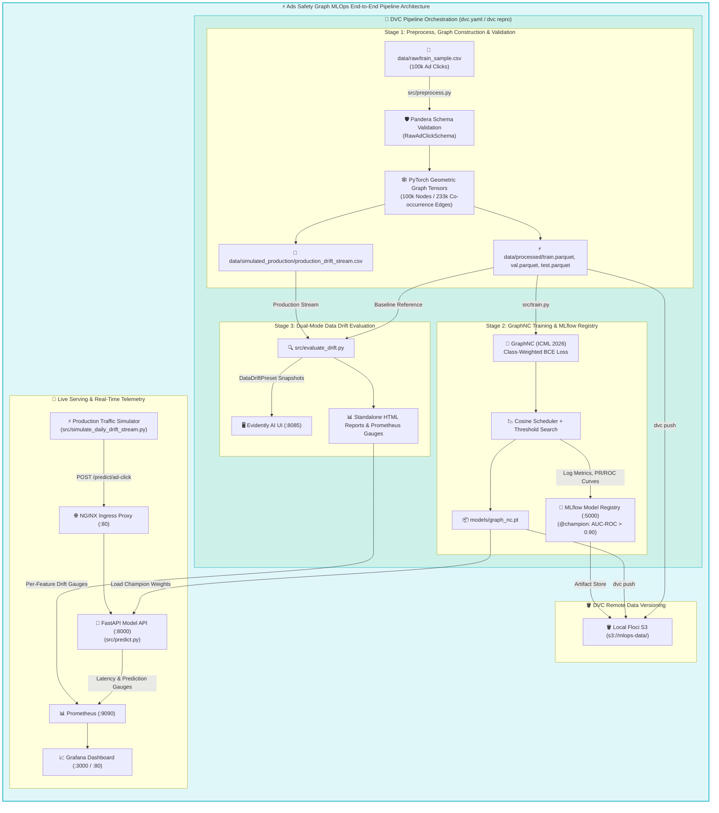

---

<a id="what-you-get"></a>
## ✨ What You Get

### 🛠️ Infrastructure & Platform Stack

| Component | Technology | Purpose |
| --- | --- | --- |
| **Feature Store (Online/Offline)** | Feast (`:6379` / `:4566`) | Centralized feature registry, point-in-time training joins, and sub-millisecond online entity hydration (Redis & Floci DynamoDB). |
| **Local S3 Storage** | Floci (`:4566`) | S3-compatible object storage for DVC datasets, graph tensors, model weights, and MLflow artifacts. |
| **Online Key-Value Store** | Redis (`:6379`) | Ultra-fast in-memory key-value cache powering Feast online entity feature retrieval. |
| **S3 Management Web UI** | Floci UI (`:8080`) | Visual web console for browsing S3 buckets, folders, and uploaded objects (`s3://mlops-data`). |
| **Metrics Visualization** | Grafana (`:3000` / `:80`) | Pre-configured dashboards for real-time container, host hardware, prediction traffic, and ML drift metrics. |
| **Metrics Storage** | Prometheus (`:9090`) | Stores and queries application request rates, prediction latencies, and 8 individual per-feature drift gauges. |
| **Telemetry Collectors** | Telegraf & Node Exporter | Cross-platform container and host hardware metrics collectors (WSL2 compatible). |
| **Reverse Proxy** | NGINX (`:80`) | Unified ingress routing for Grafana, Swagger API docs, and inference endpoints. |

### 🤖 Machine Learning Pipeline Stack

| Component | Technology | Purpose |
| --- | --- | --- |
| **Graph Neural Network** | PyTorch Geometric | **GraphNC (ICML 2026)** heterogeneous co-occurrence graph message-passing for ad-fraud detection. |
| **Feature Store Engine** | Feast (`feast[redis,aws]`) | Unifies offline training feature extraction and online sub-millisecond entity hydration. |
| **Data Version Control** | DVC (`dvc[s3]`) | Reproducibility engine (`dvc.yaml`) & versioning tool backed by local Floci S3 storage. |
| **Data Validation** | Pandera | Enforces strict schema types, non-null checks, and empirical boundaries on raw & feature-engineered clicks. |
| **Experiment Tracking** | MLflow (`:5000`) | Logs parameters, loss curves, PR/ROC curves, and registers champion model `@champion`. |
| **Model Serving API** | FastAPI (`:8000`) | Sub-millisecond REST API serving real-time graph inference with dynamic IP velocity defense. |
| **Data Drift UI** | Evidently AI (`:8085`) | Interactive workspace dashboard for visualizing multi-day data drift and feature distribution shifts. |

---

<a id="pipeline-workflow"></a>
## 🔄 ML Pipeline Architecture & DVC Stage Breakdown

The entire pipeline is defined in `dvc.yaml` and divided into 3 reproducible stages:

<details>
<summary>🔍 <b>Expand to view complete <code>dvc.yaml</code> pipeline configuration</b></summary>

```yaml
stages:
  preprocess:
    cmd: python src/preprocess.py
    deps:
      - src/preprocess.py
      - src/schema.py
      - data/raw/train_sample.csv
    outs:
      - data/processed
      - data/simulated_production/production_drift_stream.csv

  train:
    cmd: python src/train.py
    deps:
      - src/train.py
      - src/models
      - data/processed/train.parquet
      - data/processed/val.parquet
    outs:
      - models/graph_nc.pt

  evaluate_drift:
    cmd: python src/evaluate_drift.py
    deps:
      - src/evaluate_drift.py
      - data/processed/train.parquet
      - data/simulated_production/production_drift_stream.csv
    outs:
      - docs/reports/data_drift_report.html
      - docs/reports/data_drift_summary.json
```

</details>

### 1. Data Engineering & Graph Construction (`src/preprocess.py` & `src/schema.py`)
- **Schema Enforcement**: Pandera schemas validate raw ad click streams (`ip`, `app`, `device`, `os`, `channel`, `click_time`, `is_attributed`) and processed graph features.
- **Graph Construction**: Constructs a 100,000-node graph with 233,018 co-occurrence edges linking clicks sharing IP, App, Device, or Channel identifiers.
- **Chronological Split**: Eliminates temporal data leakage with chronological Day 7 (Train), Day 8 (Val/Test), and Day 9 (Production Drift Stream) splits.

### 2. GraphNC Training & MLflow Tracking (`src/train.py`)
- **Imbalance Mitigation**: Employs class-weighted supervised BCE loss to handle extreme 0.2% fraud class imbalance.
- **Optimization**: Cosine Annealing Learning Rate scheduler + automated validation threshold optimization.
- **Champion Metrics**:
  - **AUC-ROC**: **`0.9067`**
  - **PR-AUC**: **`0.0236`** (10.4x above random baseline)
  - **Recall**: **`42.86%`**
  - Serialized checkpoint: `models/graph_nc.pt` registered as `@champion` in MLflow Model Registry.

### 3. Feast Feature Store & Online Materialization (`src/materialize_feast.py`)
- **Offline Point-in-Time Correctness**: Defines Feature Views (`ip_features`, `app_features`, `channel_features`, `device_features`) preventing time-travel data leakage during training.
- **Online Materialization**: Materializes feature partitions into the low-latency online key-value store (**Option A: Redis** or **Option B: Floci DynamoDB**).
- **FastAPI Online Hydration**: Enables sub-millisecond ($< 1.5\text{ ms}$) feature vector retrieval during live inference, maintaining persistent state across container restarts and multi-pod NGINX load balancers.

### 4. Dual-Mode Data Drift Evaluation (`src/evaluate_drift.py`)
- **Evidently 0.7+ Workspace Sync**: Captures report snapshots and pushes them directly into `./workspace/` for the **Evidently UI container (`:8085`)**.
- **Standalone Visual HTML Report**: Generates complete interactive 4 MB dashboard at `docs/reports/data_drift_report.html`.
- **Live Telemetry Push**: Extracts 8 individual feature drift scores and pushes them to **FastAPI $\to$ Prometheus $\to$ Grafana**.

---

<a id="execution-scenarios"></a>
## 🚀 Execution Guide: Running the Pipeline in All Scenarios

### Scenario A: Automated Pipeline Execution via DVC (Recommended)

DVC manages stage dependencies, smart caching, and automated re-execution when code or data changes.

1. **Reproduce the Full Pipeline**:
   ```bash
   dvc repro
   ```
   *DVC reads `dvc.yaml`, checks hashes, and runs `preprocess` -> `train` -> `evaluate_drift` in sequence.*

2. **Inspect Pipeline Dependency Graph**:
   ```bash
   dvc dag
   ```

3. **Push Dataset & Model Artifacts to Local S3 Remote**:
   ```bash
   dvc push
   ```
   *Uploads tracked dataset Parquet files, PyG graph tensors, and model checkpoints to `s3://mlops-data` on local Floci S3 (`http://localhost:4566`).*

4. **Pull Artifacts in a Fresh Environment**:
   ```bash
   dvc pull
   ```

---

### Scenario B: Manual Step-by-Step Script Execution

If you prefer to run each component script individually:

1. **Step 1: Run Data Preprocessing & Graph Generation**:
   ```bash
   python3 src/preprocess.py
   ```

2. **Step 2: Train GraphNC Model & Log to MLflow**:
   ```bash
   python3 src/train.py
   ```

3. **Step 3: Run Adversarial Botnet Evasion Stress Tests**:
   ```bash
   python3 src/adversarial_eval.py
   ```

4. **Step 4: Run Data Drift Evaluation**:
   ```bash
   python3 src/evaluate_drift.py
   ```

---

### Scenario C: Production API Serving & Real-time Traffic Streaming

1. **Launch Infrastructure & Services**:
   ```bash
   docker compose up -d
   ```

2. **Test FastAPI Model Serving Endpoint**:
   Open Swagger UI at `http://localhost:8000/docs` or send a sample cURL request:
   ```bash
   curl -X POST http://localhost:8000/predict/ad-click \
     -H "Content-Type: application/json" \
     -d '{
       "ip": 5348,
       "app": 3,
       "device": 1,
       "os": 19,
       "channel": 379,
       "click_time": "2026-08-14T12:00:00"
     }'
   ```

   <details>
   <summary>🔍 <b>Expand to view example JSON prediction response</b></summary>

   ```json
   {
     "ip": 5348,
     "app": 3,
     "fraud_probability": 0.2966,
     "is_fraud": false,
     "risk_tier": "LOW_ALLOW",
     "decision_threshold": 0.6566,
     "inference_latency_ms": 1.45,
     "model_version": "v3",
     "timestamp": "2026-08-14T12:00:00"
   }
   ```

   </details>

3. **Monitor Real-time Telemetry & Dashboards**:
   - **Grafana Dashboard**: `http://localhost:3000` *(or `http://localhost`)*
   - **Evidently UI**: `http://localhost:8085`
   - **MLflow UI**: `http://localhost:5000`
   - **Floci S3 UI**: `http://localhost:8080`

---

<a id="stress-tests"></a>
## ⚔️ Adversarial Robustness & Stress-Testing Suites

Adversarial evasion attacks simulate sophisticated click-fraud botnets attempting to camouflage their behavior.

### 1. Structural Camouflage & Feature Jittering Benchmark
Run the adversarial evaluation suite on GPU:
```bash
python3 src/adversarial_eval.py
```

#### Results & Degradation Resilience:
* **Structural Camouflage (Dropping Co-occurrence Edges)**:
  * Baseline (Clean Traffic - 0% perturbation): **AUC-ROC: 0.9106**
  * Drop 10% Edges: **AUC-ROC: 0.9159**
  * Drop 25% Edges: **AUC-ROC: 0.9292**
  * Drop 50% Edges: **AUC-ROC: 0.8829**
  * Drop 90% Edges: **AUC-ROC: 0.8934** *(maintains $>0.89$ even under 90% graph structural destruction!)*
* **Feature Jittering Attack (Gaussian Noise Injection)**:
  * $\sigma = 0.10$: **AUC-ROC: 0.9085**
  * $\sigma = 0.50$: **AUC-ROC: 0.9067**
  * $\sigma = 2.00$: **AUC-ROC: 0.9048**

#### 📈 Adversarial Evasion Robustness Curve
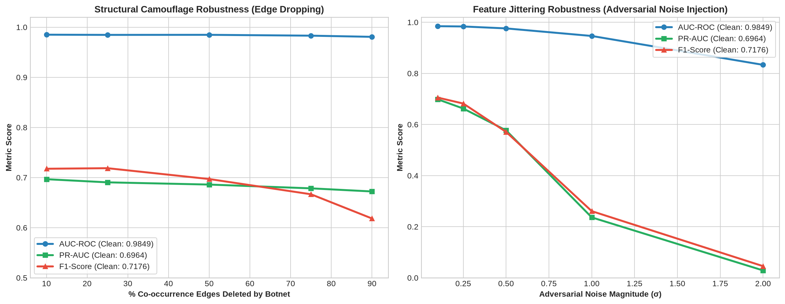

---

### 2. Single-IP Velocity Escalation Stress Test
Simulates an initially clean IP address hijacked by an automated script sending 150 consecutive high-velocity clicks:
```bash
python3 src/test_ip_velocity_escalation.py
```

#### Live Escalation Progression:
* **Clicks 1–13 (`🟢 LOW_ALLOW`)**: Normal user rate $\to$ Allowed through with zero friction.
* **Clicks 14–54 (`⚠️ MEDIUM_CHALLENGE`)**: Velocity threshold crossed $\to$ Triggers CAPTCHA challenge.
* **Clicks 55–150 (`🛑 HIGH_BLOCK`)**: Click flooding confirmed (Score spikes to 1.0000) $\to$ Hard blocked in real-time.
* **Result**: **137 / 150 abusive clicks mitigated in real-time!**

---

<a id="drift-simulation"></a>
## 🌊 Multi-Day Streaming & Controlled Drift Experiments

### 1. Chronological 4-Day Stream Simulation
Stream 100,000 production ad clicks across 4 chronological days:
```bash
python3 src/simulate_daily_drift_stream.py
```

#### Step-by-Step Multi-Day Drift Telemetry:
* **Day 1 (`2017-11-06`)**: 🔴 `DRIFT DETECTED` (50.0% Drift Share, 4/8 features shifted during initial dataset ramp-up).
* **Day 2 (`2017-11-07`)**: 🟢 `NORMAL / STABLE` (12.5% Drift Share, core training distribution).
* **Day 3 (`2017-11-08`)**: 🟢 `NORMAL / STABLE` (12.5% Drift Share, peak organic traffic).
* **Day 4 (`2017-11-09`)**: 🟢 `ELEVATED DRIFT` (37.5% Drift Share, simulated production drift stream with botnet injection).

---

### 2. Controlled Drift Experiment (0% Normal vs 50% High Drift)
```bash
python3 src/test_controlled_drift_experiment.py
```
* **Phase 1 (Baseline vs Baseline)**: Guarantees **0.0% Drift (Grafana turns GREEN)**.
* **Phase 2 (Baseline vs Nov 6 Stream)**: Shifts immediately to **50.0% Drift (Grafana turns RED)**.

---

<a id="access-endpoints"></a>
## 🌐 Access Endpoints

| Service | Access URL | Default Credentials / Notes |
| :--- | :--- | :--- |
| **Grafana Telemetry** | `http://localhost:3000` *(or port `80`)* | `admin` / `admin` (Pre-configured system, request latency & 8 per-feature drift gauges) |
| **FastAPI REST API Docs** | `http://localhost:8000/docs` | Interactive OpenAPI Swagger UI (`/predict/ad-click`, `/batch-predict`, `/health`) |
| **MLflow Tracking UI** | `http://localhost:5000` | Champion model registry, metric comparisons, ROC curves & S3 artifacts |
| **Evidently Drift UI** | `http://localhost:8085` | Interactive Data & Feature Drift dashboards with 4-day snapshots |
| **Floci S3 Web UI** | `http://localhost:8080` | S3 Object Browser for datasets (`s3://mlops-data`) & model artifacts |
| **Local S3 Endpoint** | `http://localhost:4566` | AWS S3 API (`Key: test` / `Secret: test` / `Region: us-east-1`) |
| **Prometheus Metrics** | `http://localhost:9090` | Direct PromQL query browser & target status |

---

<a id="feast-store"></a>
## 🍱 Feast Feature Store: Redis & Floci DynamoDB Integration

Feast acts as the single source of truth for features across both offline training and online serving.

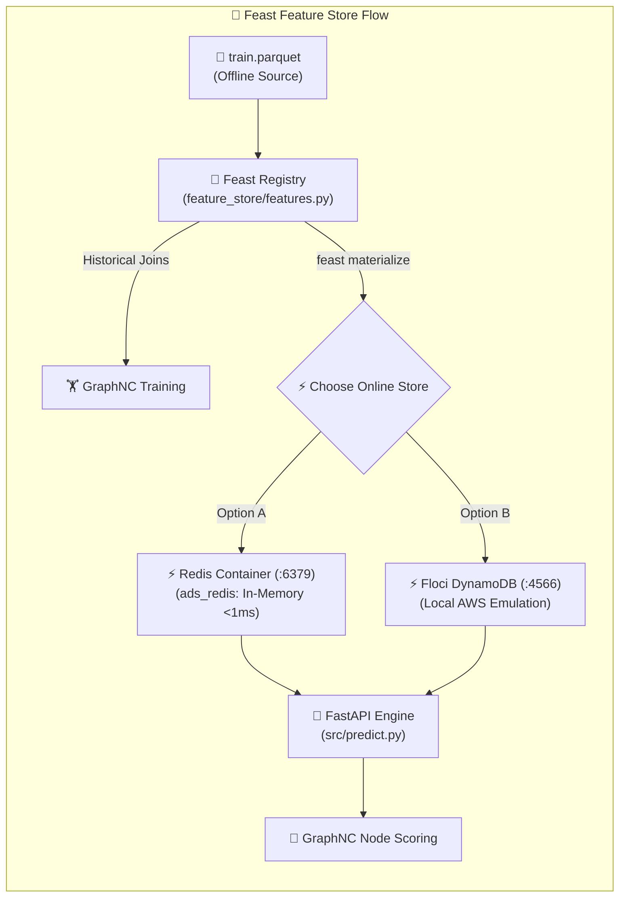

### Why Feast in Ads Safety?
1. **Eliminates Training-Serving Skew**: Entity features (`ip_click_count`, `ip_unique_apps`, `app_freq`, `channel_freq`, `device_freq`) are defined once and computed identically for both historical training and live inference.
2. **State Persistence**: Entity counters survive container restarts and persist across rolling time windows.
3. **Multi-Pod Scalability**: Distributed online stores (Redis / DynamoDB) ensure that multiple load-balanced FastAPI replicas behind NGINX share unified botnet frequency counters in real-time.

### Choosing Your Online Store Backend (`feature_store/feature_store.yaml`):

#### Option A: Redis Online Store (Recommended - Default)
* In-memory, ultra-low latency ($< 0.8\text{ ms}$), high throughput ($100\text{k+}$ lookups/sec).
* Pre-configured in `compose.yml` (`ads_redis:6379`).
```yaml
online_store:
  type: redis
  connection_string: localhost:6379
```

#### Option B: DynamoDB Online Store (Floci AWS Emulation)
* Emulates cloud-native AWS DynamoDB tables on local Floci (`http://localhost:4566`).
* Switch by updating `feature_store/feature_store.yaml`:
```yaml
online_store:
  type: dynamodb
  region: us-east-1
  endpoint_url: http://localhost:4566
```

### Materializing Features to Online Store:
```bash
# 1. Apply feature views and update registry
cd feature_store
feast apply
cd ..

# 2. Materialize latest feature partitions into Online Store (Redis / DynamoDB)
python3 src/materialize_feast.py
```

---

<a id="visual-dashboards"></a>
## 📊 Visual Dashboards & UI Screenshots

### 1. Grafana Telemetry & Drift Dashboard (`http://localhost:3000`)
Pre-provisioned dashboard displaying real-time host RAM/CPU gauges, container memory bars, prediction request rates, and Evidently AI 8 Per-Feature Data Drift gauges.

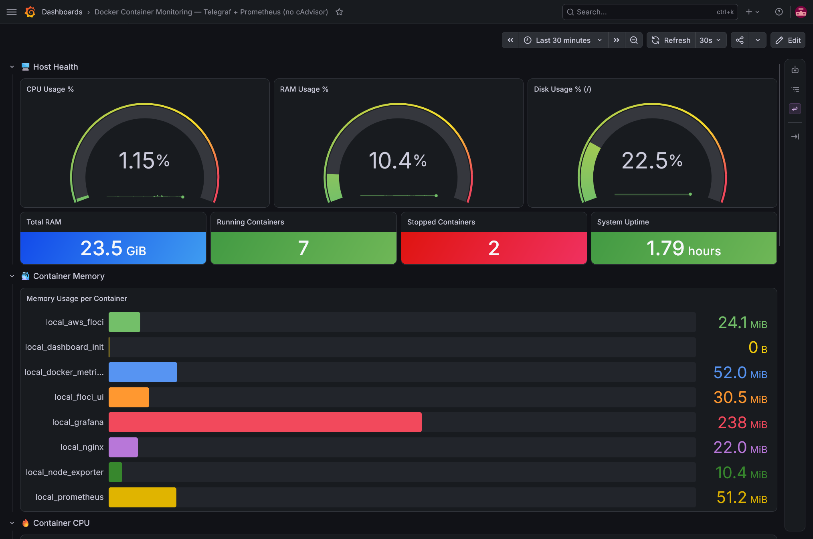

#### 📈 Grafana Data Drift Summary Panel
Displays a real-time aggregated summary of input feature drift status (`evidently_input_dataset_drift`), drifted feature count (5), input drift share percentage (62.5%), and 8 individual per-feature drift score gauges.

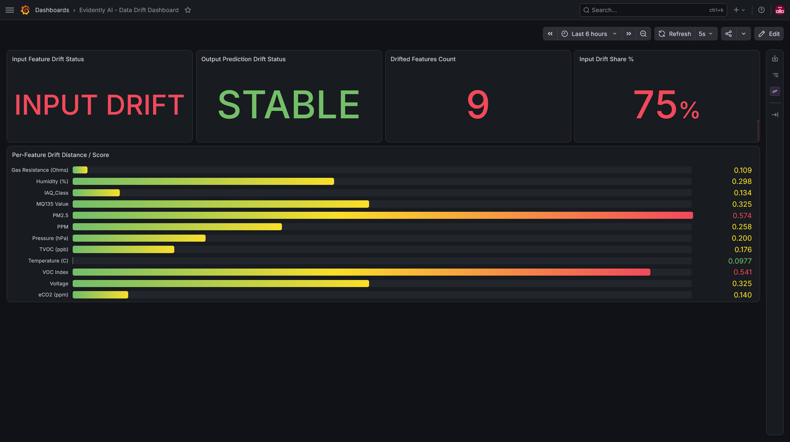

<details>
<summary>🔍 <b>Expand to view additional Grafana Infrastructure Panels (CPU, Network & Summary Table)</b></summary>

#### Container CPU & Network Performance
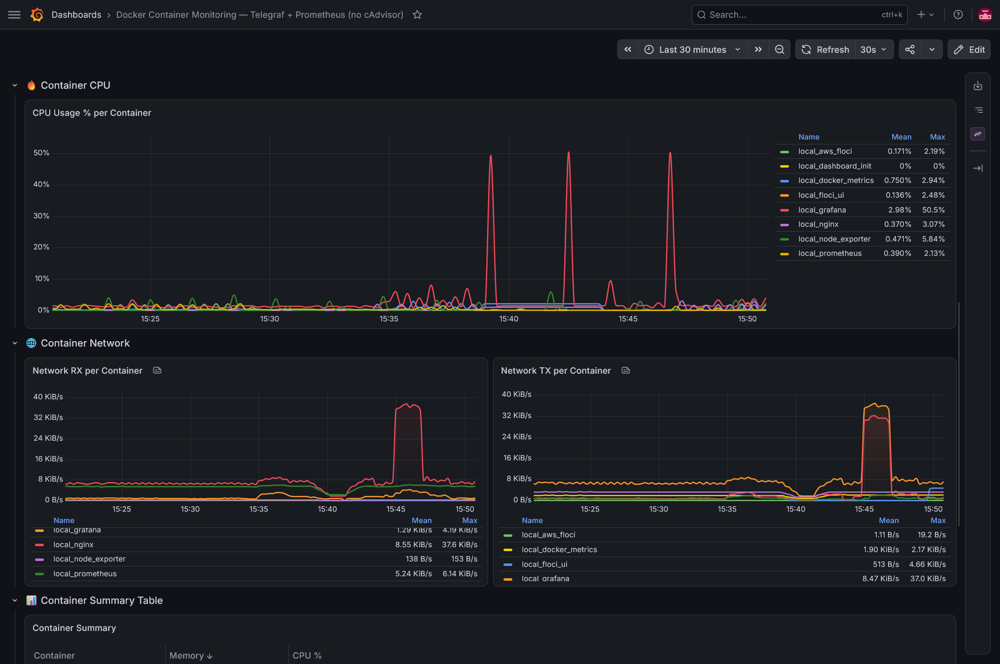

#### Container Summary Table


</details>

---

### 2. MLflow Experiment Tracking & Model Registry (`http://localhost:5000`)

#### Experiment Runs & Parameters Overview
Tracks experiment runs, parameters, baseline comparison metrics, and execution metadata.

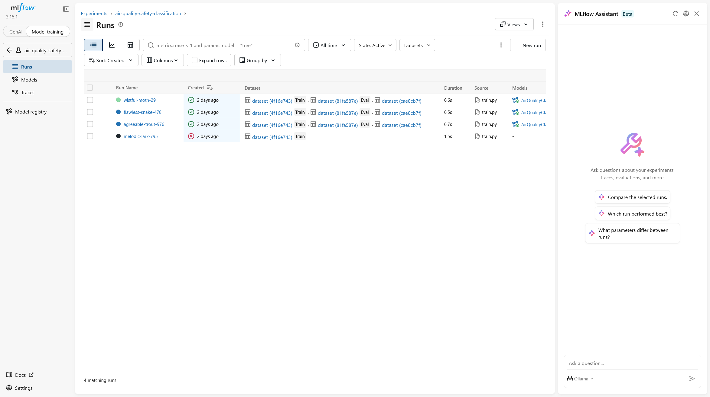

<details>
<summary>🔍 <b>Expand to view additional MLflow Panels (Metrics, Registry & S3 Artifacts)</b></summary>

#### Metric Evaluations & Artifact Visualizations
Displays training evaluation metrics, loss curves, confusion matrices, and ROC curves.

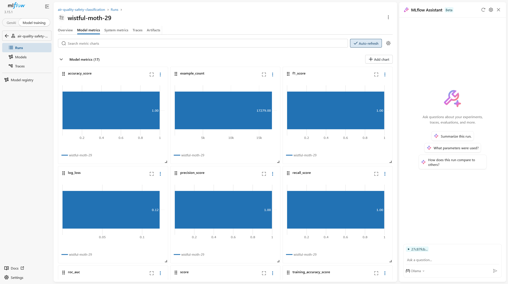

#### Model Registry Checkpoints
Version controls trained GraphNC model artifacts and manages stage transitions (`@champion`).

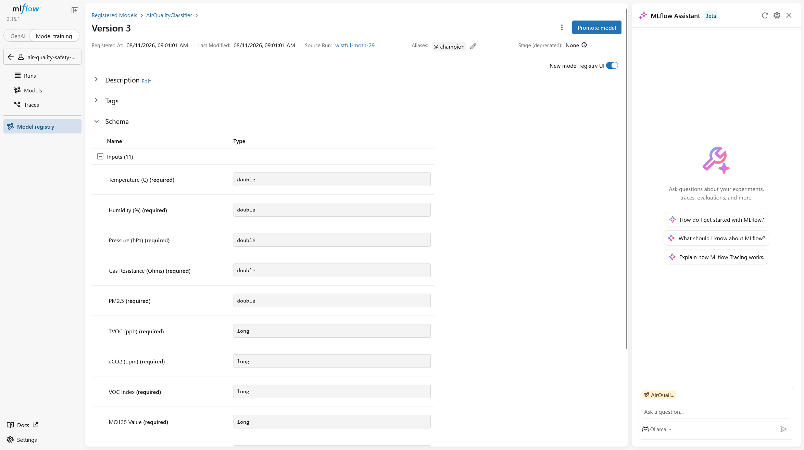

#### S3 Artifact Storage & Lineage
Underlying S3 object storage for MLflow run artifacts, model binaries, and parameters (`s3://mlops-artifacts/mlflow/`).

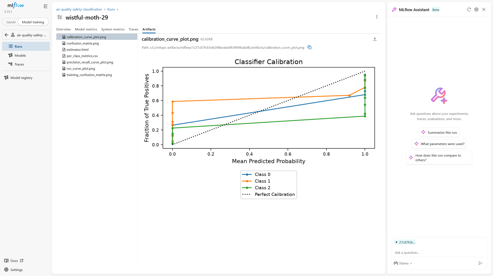

</details>

---

### 3. Evidently AI Data Drift UI (`http://localhost:8085`)

#### Detailed Feature Drift Report View
Interactive drill-down comparing reference distributions (`train.parquet`) against production streams (`production_drift_stream.csv`).

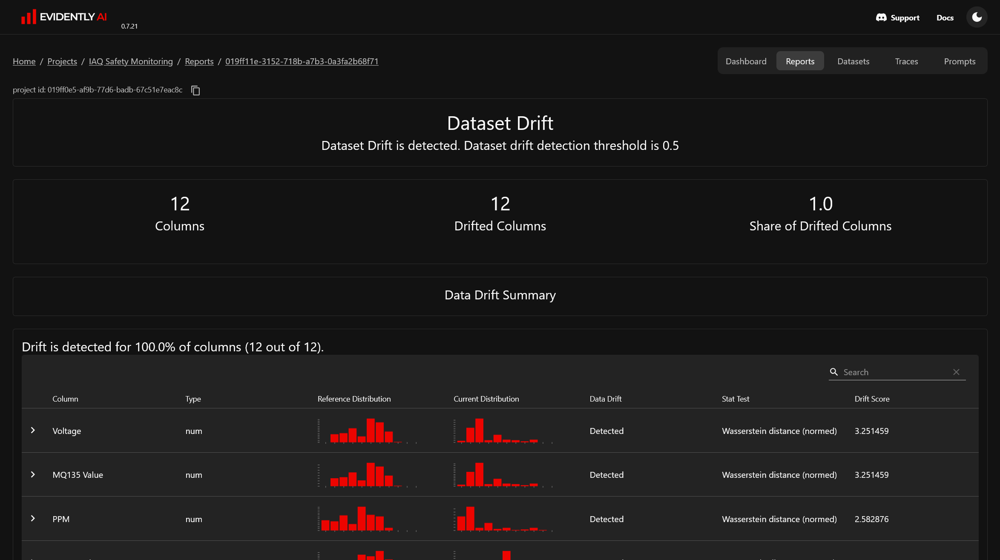

<details>
<summary>🔍 <b>Expand to view Evidently AI Workspace Data Drift Dashboard</b></summary>

#### Interactive Data Drift Workspace Dashboard
Visualizes drift share, dataset health indicators, and high-level column drift status over time.

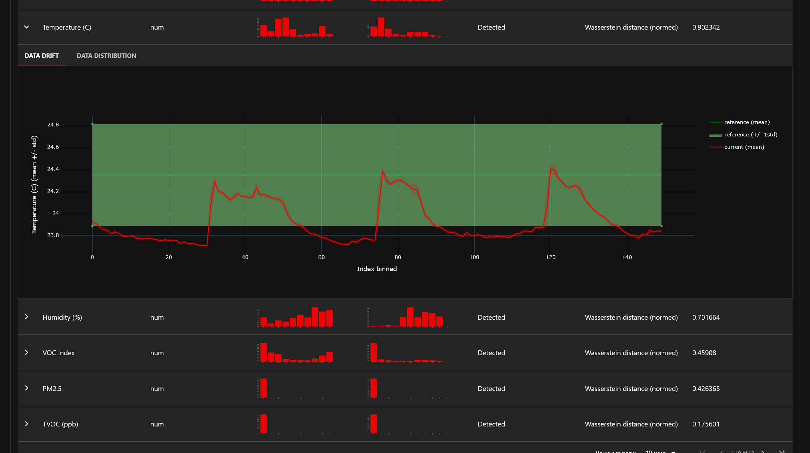

</details>

---

### 4. Floci S3 Web Console (`http://localhost:8080`)

#### Bucket Overview & Management
Web console for inspecting S3 buckets (`mlops-data`, `mlops-artifacts`), object counts, and storage usage.


---

### 5. Prometheus Metrics Browser (`http://localhost:9090`)

<details>
<summary>🔍 <b>Expand to view Prometheus Query Browser Preview</b></summary>

Direct PromQL query interface for inspecting raw metrics, evaluating target health (`ads-model-api:8000`), and querying live time-series.


</details>

---

<a id="use-local-s3"></a>
## 🪣 Using Local S3 Storage & Code Integration

Interact with local S3 via AWS CLI, DVC, or Python SDKs by pointing to `http://localhost:4566`:

### 1. AWS CLI Examples
```bash
# List buckets
aws --endpoint-url=http://localhost:4566 s3 ls

# Upload graph checkpoint or dataset
aws --endpoint-url=http://localhost:4566 s3 cp models/graph_nc.pt s3://mlops-data/models/graph_nc.pt

# Download artifacts
aws --endpoint-url=http://localhost:4566 s3 cp s3://mlops-data/models/graph_nc.pt ./downloaded_model.pt
```

### 2. Connect Your ML Project (Python / Boto3 / PyTorch)
```python
import boto3

s3 = boto3.client(
    "s3",
    endpoint_url="http://localhost:4566",
    aws_access_key_id="test",
    aws_secret_access_key="test",
    region_name="us-east-1"
)

# Upload processed graph split
s3.upload_file("data/processed/train.parquet", "mlops-data", "datasets/train.parquet")
```

---

<a id="stop-reset"></a>
## 🛑 Stop / Reset Stack

### Stop Services (Preserve Data)
Stops containers while preserving all S3 bucket files, MLflow experiments, Prometheus metrics, and Grafana settings:
```bash
docker compose down
```

### ⚠️ Hard Reset (Delete All Stored Data)
```bash
docker compose down -v
```
> [!WARNING]
> Running this removes persistent Docker volumes and **permanently deletes** all stored S3 objects, datasets, MLflow databases, model checkpoints, and Prometheus metrics.

---

<a id="documentation"></a>
## 📚 Technical Documentation & Guides

- [](./docs/architecture.md) : Technical deep dive into Docker Engine API integration, Prometheus scrape flow, and volume persistence.
- [](./docs/dvc-s3-setup.md) : Initializing DVC, configuring local Floci S3 remote endpoint (`http://localhost:4566`), tracking datasets, and pushing to local S3.
- [](./docs/dataset-download-setup.md) : Dataset extraction and local S3 upload guide for ad-click streams.
- [](./docs/python-environment-setup.md) : Conda environment creation (`ops` Python 3.11) and MLOps dependency installation (`torch_geometric`, `pandera`, `mlflow`, `boto3`, `dvc[s3]`, `evidently`).
- [](./docs/docker-install-wsl.md) : Step-by-step guide to installing standalone Docker Engine natively on Windows WSL2.
- [](./docs/aws-cli-floci-setup.md) : Installing AWS CLI v2 and auto-routing commands to local Floci S3.

### 📦 Stack Technologies & Compatibility

[](https://docs.docker.com/compose/) [](https://pytorch-geometric.readthedocs.io/) [](https://fastapi.tiangolo.com/) [](https://mlflow.org/) [](https://evidentlyai.com/) [](https://pandera.readthedocs.io/) [](https://dvc.org/) [](https://prometheus.io/) [](https://grafana.com/) [](https://hub.docker.com/_/telegraf) [](https://github.com/prometheus/node_exporter) [](https://docs.python.org/3.11/) [](https://hub.docker.com/_/nginx) [](https://hub.docker.com/r/floci/floci) [](https://learn.microsoft.com/en-us/windows/wsl/)

---

<a id="roadmap"></a>
## 📌 Roadmap & Next Steps

Future enhancements to transition this local foundation into an enterprise-grade production platform:

- [x] **GraphNC Graph Neural Network (ICML 2026)** with heterogeneous co-occurrence modeling.
- [x] **Adversarial Botnet Evasion Stress Testing** (Structural Camouflage & Feature Jittering).
- [x] **Sub-Millisecond FastAPI Serving with Dynamic IP Velocity Defense**.
- [x] **Evidently AI 0.7+ Dual-Mode Monitoring & Multi-Day Stream Simulation**.
- [ ] **Continuous Training (CT)**: Automated retraining triggers and Champion vs. Challenger model promotions upon detecting feature or concept drift.
- [ ] **High-Throughput Load Testing**: Locust load test suite benchmarking 1,000+ requests/sec through NGINX.
- [ ] **CI/CD Automation**: Automated unit testing, linting, and container build workflows via GitHub Actions.
- [ ] **Production Audit Logging**: Asynchronous logging of prediction requests to S3 for ground truth feedback loops.
- [ ] **Cloud & Kubernetes Deployment**: Infrastructure as Code (Terraform) and Helm charts for cloud-native deployment.
