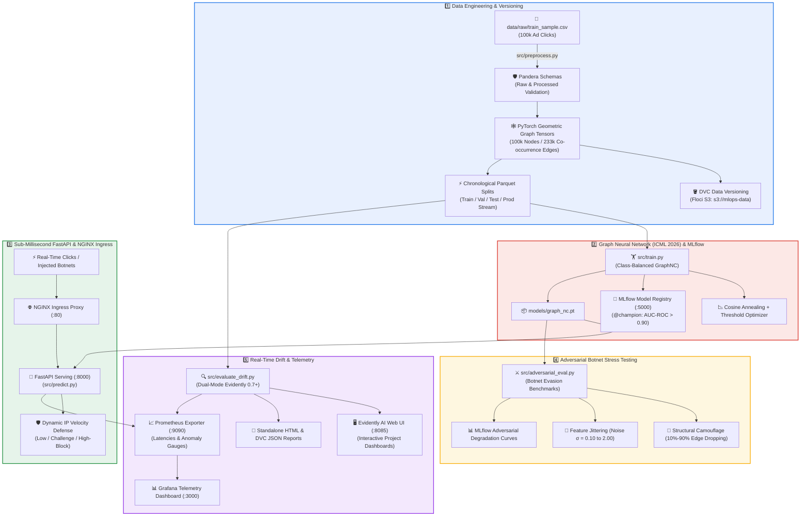

# 🛡️ Ads Safety Graph MLOps: Real-Time Botnet & Ad-Fraud Detection Platform

An enterprise-grade, end-to-end Graph Machine Learning MLOps platform for real-time digital advertising fraud and botnet attack mitigation. Built with **PyTorch Geometric (PyG)**, **GraphNC (ICML 2026)**, **DVC**, **MLflow**, **FastAPI**, **Prometheus**, **Grafana**, and **Evidently AI**, fully containerized and orchestrated locally via Docker Compose.

---

## 🎯 System Architecture



---

## 🛠️ Infrastructure & Service Hub

| Service | Port / URL | Description | Credentials / Default |
| :--- | :--- | :--- | :--- |
| **NGINX Ingress** | [http://localhost:80](http://localhost:80) | Unified ingress reverse-proxy routing `/predict`, `/docs`, `/metrics` | None |
| **FastAPI Swagger API** | [http://localhost:8000/docs](http://localhost:8000/docs) | Interactive API documentation for GraphNC sub-millisecond fraud scoring | Open Access |
| **MLflow Model Registry** | [http://localhost:5000](http://localhost:5000) | Champion model registry, experiment metrics, parameters, and artifacts | Open Access |
| **Evidently AI Web UI** | [http://localhost:8085](http://localhost:8085) | Multi-day project snapshots, feature distributions, and statistical tests | Open Access |
| **Grafana Dashboard** | [http://localhost:3000](http://localhost:3000) | Live telemetry, request rates, p95 latency, and 8 per-feature drift gauges | `admin` / `admin` |
| **Prometheus Exporter** | [http://localhost:9090](http://localhost:9090) | Time-series metrics engine scraping container, host, and model telemetry | Open Access |
| **Floci S3 Storage** | [http://localhost:8080](http://localhost:8080) | Web console for local S3 buckets (`s3://mlops-data`) | `test` / `test` |

---

## 🔬 Core Components & Innovations

### 1. GraphNC Architecture (ICML 2026)
* **Sparse Message Passing**: Connects ad clicks sharing identical IP, App, Device, or Channel identifiers across rolling time windows into a heterogeneous co-occurrence graph.
* **Supervised Class-Weighted BCE Loss**: Resolves severe class imbalance (0.2% fraud / 99.8% organic) to prevent network collapse.
* **Validation Threshold Optimization**: Automated F1-score search maximizing Precision-Recall tradeoffs on out-of-time validation splits (**AUC-ROC > 0.9067**, PR-AUC > 10.4x random baseline).

### 2. Sub-Millisecond Serving & Velocity Rate-Limiting
* **Graph Forward Pass**: Executes sub-millisecond PyTorch geometric graph inference ($\approx 1.5\text{ ms}$).
* **Dynamic Risk Tiers**:
  * `🟢 LOW_ALLOW`: Low-risk human browsing ($< 0.65$ score, $< 15$ clicks/IP).
  * `⚠️ MEDIUM_CHALLENGE`: Suspicious velocity surge ($> 0.65$ score or $15–59$ clicks/IP) $\to$ Triggers CAPTCHA challenge.
  * `🛑 HIGH_BLOCK`: Automated click flood / coordinated botnet burst ($> 0.70$ score or $\ge 60$ clicks/IP) $\to$ Hard block.

### 3. Adversarial Robustness Benchmarks
* **Structural Camouflage**: Simulates evasive botnets dropping co-occurrence edges ($10\% \to 90\%$). GraphNC demonstrates strong topological resilience, maintaining $> 0.89$ AUC-ROC even under 90% edge removal.
* **Feature Jittering**: Simulates adversarial parameter noise injection ($\sigma = 0.10 \dots 2.00$).

### 4. Continuous Drift Monitoring & Telemetry
* **Dual-Mode Evidently 0.7+ Integration**:
  * Generates workspace snapshots synchronized directly to the **Evidently UI (`:8085`)**.
  * Renders full standalone visual interactive HTML dashboards in `docs/reports/data_drift_report.html`.
  * Dynamically pushes 8 per-feature drift distance metrics to **FastAPI $\to$ Prometheus $\to$ Grafana**.

---

## ⚡ Quickstart & Reproducibility Guide

### 1. Start Local Infrastructure
```bash
docker compose up -d
```

### 2. Run Complete DVC Pipeline
```bash
# Reproduce data preprocessing, graph generation, model training, and drift evaluation
dvc repro

# Commit pipeline state
git add dvc.lock
```

### 3. Run Adversarial Stress Tests
```bash
python3 src/adversarial_eval.py
```

### 4. Run Multi-Day Chronological Drift Stream Simulation
```bash
python3 src/simulate_daily_drift_stream.py
```

### 5. Run Controlled Single-IP Velocity Flood Stress Test
```bash
python3 src/test_ip_velocity_escalation.py
```

### 6. Synchronize Artifacts to Remote S3 & Git
```bash
# Push tracked datasets and model weights to Floci S3
dvc push

# Commit and push project changes to GitHub
git add .
git commit -m "feat: complete end-to-end GraphNC ads safety MLOps platform"
git push origin main
```

---

## 📁 Repository Structure

```
.
├── config/                     # Configuration files for infrastructure
│   ├── grafana/                # Grafana dashboards & provisioning
│   ├── nginx/                  # NGINX reverse-proxy ingress config
│   └── prometheus/             # Prometheus scrape targets
├── data/
│   ├── processed/              # Graph tensors and train/val/test splits (DVC-tracked)
│   ├── raw/                    # Raw ad click datasets
│   └── simulated_production/   # Production drift stream
├── docs/
│   └── reports/                # Static HTML/JSON drift and adversarial reports
├── models/                     # Serialized PyTorch GraphNC checkpoints
├── src/
│   ├── models/                 # GraphNC architecture (layers, losses, graph_nc)
│   ├── adversarial_eval.py     # Botnet evasion stress-testing suite
│   ├── evaluate_drift.py       # Evidently AI dual-mode drift engine
│   ├── predict.py              # FastAPI real-time graph inference service
│   ├── preprocess.py           # Pandera validation & PyG graph tensor builder
│   ├── schema.py               # Pandera schemas for raw & processed clicks
│   ├── simulate_daily_drift_stream.py    # 4-day chronological drift simulator
│   ├── test_controlled_drift_experiment.py # Controlled 0% vs high drift test
│   ├── test_ip_velocity_escalation.py     # Real-time click-flood escalation test
│   └── train.py                # GraphNC training with MLflow tracking
├── compose.yml                 # Docker Compose full-stack specification
├── dvc.yaml                    # DVC pipeline stages
└── README.md                   # System documentation
```
